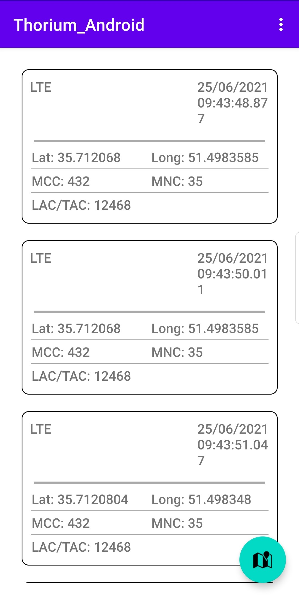
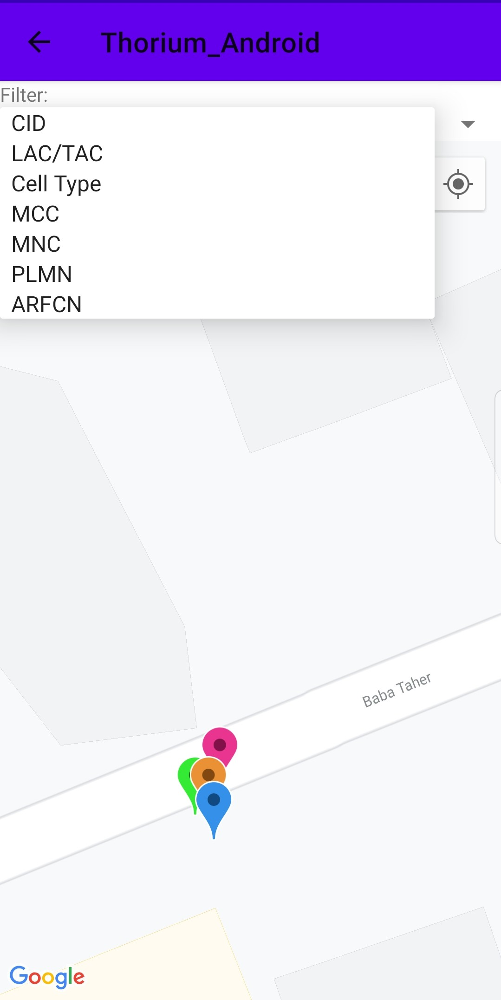

# Thorium_Android
## Trace model network informaion on your trip
This android application trace network information during your trip; including: 
- Latitude and Longitude
- Cell ID
- Cell Type
- MCC
- MNC
- LAC/ TAC
- PLMN

Android version 10 and SDK 30(min 28)

## Preview

### Home View
  

### Map View
  

## Our Team:
- Ahmadreza Sanatjou(a.reza.sanatjoo@gmail.com)
- Mahsa Ghaderan(mahsa.ghaderan@gmail.com)

## Features

- Trace Cell ID, Cell type, PLMN, LAC/TAC, ARFCN/eARFCN/,
- Save Cell Info using RoomDataBase.
- Show each Cell on google map
- Use different coloring method due user preference

## Tech
- Android, kotlin
- MVVM architecture
- Room DataBase
- Google Map

## License

MIT
